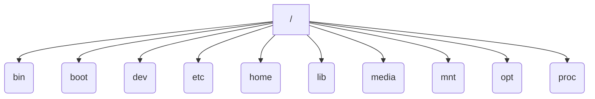
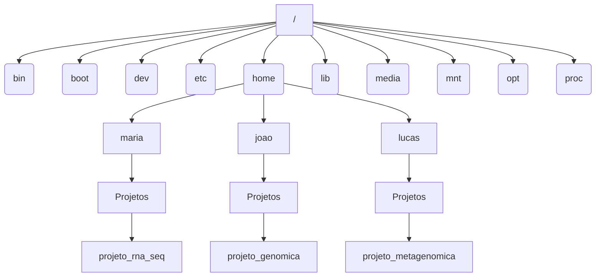
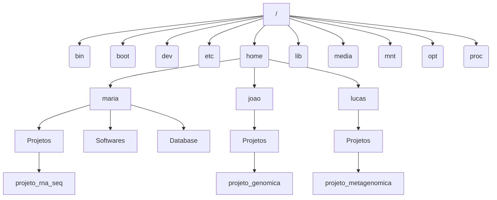

# Guia de boas práticas computacionais para desenvolvedores em bioinformática

Esta aula tem como objetivo apresentar conceitos fundamentais relacionados ao uso responsável de ambientes computacionais compartilhados, estruturação de diretórios, organização de projetos, gerenciamento de arquivos e utilização eficiente de recursos computacionais em ambientes Linux e servidores multiusuário.

Nesse contexto, a adoção de boas práticas computacionais é fundamental para garantir eficiência, segurança, padronização e escalabilidade no desenvolvimento de análises e *pipelines* usados na bioinformática.

## Objetivos da aula

É esperado que o aluno ao final dessa aula seja capaz de:

- [Compreender quais são as políticas, condutas e responsabilidades éticas dentro de um ambiente multiusuário](#condutas-e-responsabilidades-em-um-ambiente-multiusuário)
- [Conhecer a estrutura de diretórios Linux](#conhecendo-a-hierarquia-de-diretórios-linux);
- [Organizar de forma padronizada a estrutura de diretórios e arquivos](#organização-de-diretórios-e-arquivos);
- [Conhecer os recursos compartilhados disponíveis](#recursos-computacionais-compartilhados). 


# Boas práticas em servidores compartilhados

Servidores compartilhados são ambientes amplamente utilizados em universidades, laboratórios de pesquisa e empresas para execução de análises, armazenamento de dados e desenvolvimento de projetos. Nesse tipo de infraestrutura, vários usuários utilizam simultaneamente os mesmos recursos computacionais, como processamento, memória, armazenamento e rede.

Por isso, o uso responsável e organizado do ambiente é fundamental para garantir estabilidade, desempenho e boa convivência entre todos os usuários.

Assim como em uma residência compartilhada, a convivência depende de respeito, organização e responsabilidade.

Em um servidor:

- O armazenamento em disco é limitado;
- O processamento e a memória são divididos entre os usuários;
- Arquivos desnecessários (ou duplicados) ocupam espaço em disco;
- Processos mal executados podem comprometer o desempenho do sistema inteiro.

Quando um único usuário utiliza recursos de forma inadequada, todos os demais podem ser impactados. Isso inclui lentidão no sistema, falhas em tarefas agendadas e indisponibilidade temporária de serviços. Dessa forma, cada usuário deve compreender que suas ações afetam diretamente a experiência coletiva.

## Políticas, condutas e responsabilidade ética em um ambiente multiusuário

Cada servidor possui políticas próprias de utilização, definidas pela equipe responsável pela administração do sistema.

Essas políticas existem para:

- Garantir estabilidade do ambiente;
- Preservar os recursos computacionais;
- Proteger dados institucionais;
- Evitar uso abusivo da infraestrutura.

Entre as condutas consideradas inadequadas estão:

- Uso excessivo e injustificado de processamento;
- Armazenamento abusivo de arquivos;
- Execução de *softwares* não autorizados;
- Compartilhamento indevido de contas;
- Desrespeito às diretrizes do servidor.

Dependendo da gravidade ou recorrência do problema, o usuário pode sofrer:

- Advertências;
- Limitação temporária de recursos;
- Suspensão de acesso;
- Bloqueio definitivo da conta.

Por isso, é importante que todos os usuários conheçam e sigam as normas estabelecidas pela administração do servidor.

### Confidencialidade e integridade de dados genômicos

Dados genômicos e informações relacionadas à saúde representam um dos tipos mais sensíveis de dados utilizados em pesquisa científica e ambientes computacionais. Sequências genéticas, variantes genômicas, metadados clínicos e informações de pacientes possuem alto valor científico e, ao mesmo tempo, exigem elevados níveis confidencialidade e integridade.

A confidencialidade refere-se à garantia de que apenas pessoas autorizadas tenham acesso às informações armazenadas no sistema. A quebra de confidencialidade pode expor informações extremamente sensíveis sobre saúde, ancestralidade, predisposição genética e características individuais dos pacientes, gerando riscos éticos, científicos e jurídicos. 

Já a integridade dos dados refere-se à preservação da consistência e autenticidade das informações durante armazenamento, transferência, processamento e compartilhamento.

Uma das formas mais utilizadas para verificar a integridade de arquivos é através do uso do *md5sum*. O MD5 (*Message Digest Algorithm 5*) é um algoritmo que gera uma assinatura digital única, conhecida como *hash*, a partir do conteúdo de um arquivo. Essa assinatura funciona como uma impressão digital do arquivo: caso qualquer alteração ocorra, mesmo que seja a modificação de apenas um único byte, o valor do *hash* MD5 será completamente diferente. Dessa forma, o *md5sum* permite confirmar se um arquivo recebido é exatamente igual ao arquivo original enviado.

Em projetos de sequenciamento genômico, é uma boa prática que centros de sequenciamento, plataformas de dados ou laboratórios forneçam juntamente aos arquivos um arquivo contendo os hashes MD5 correspondentes. Esse arquivo geralmente possui nomes como:

```bash
md5sum.txt
checksums.md5
MD5SUM
```

Garantir a confidencialidade e integridade dos dados não é apenas uma questão técnica, mas também uma responsabilidade científica, ética e legal. Por esses motivos, o controle de permissões, autenticação de usuários, uso de senhas seguras e restrição de acesso aos dados genômicos são medidas fundamentais em ambientes computacionais.

## Conhecendo a hierarquia de diretórios Linux

Os sistemas operacionais baseados em Linux utilizam uma estrutura hierárquica de diretórios para organizar arquivos, programas e recursos do sistema. Essa organização segue um modelo em árvore invertida, no qual todos os diretórios se originam a partir de um diretório principal denominado raiz (*root*). O ponto inicial dessa estrutura é o diretório raiz representado pelo símbolo (/):



Todos os demais diretórios e arquivos estão localizados dentro da raiz, direta ou indiretamente. Cada diretório possui funções específicas relacionadas ao funcionamento do sistema e ao armazenamento de dados dos usuários.

Compreender a hierarquia de diretórios é essencial para a navegação no sistema, organização de projetos e utilização eficiente de ambientes computacionais.

### Diretorio *home*

O diretório *home* é responsável por armazenar os diretórios pessoais dos usuários do sistema. Cada usuário possui sua própria pasta pessoal, utilizada para guardar arquivos, *scripts*, projetos e configurações individuais.

Considere um servidor compartilhado contendo três usuários: maria, joao e lucas. Cada usuário possui uma pasta pessoal dentro do diretório *home*, utilizada para armazenar seus arquivos:



Dentro de seus respectivos ambientes pessoais, cada usuário mantém um diretório dedicado aos seus projetos:

- Maria trabalha em um projeto de RNA-Seq;
- Joao desenvolve análises relacionadas a Genômica;
- Lucas executa análises de Metagenômica.

Cada usuário é considerado o proprietário (*owner*) dos arquivos e diretórios localizados em sua pasta pessoal. Dessa forma, cada um é responsável por:

- Organizar os arquivos e diretórios do projeto;
- Gerenciar *scripts*, resultados e dados brutos;
- Controlar permissões de leitura, escrita e execução;
- Garantir a integridade das análises.

Caso Maria deseje permitir que João visualize resultados do projeto de RNA-Seq, ela deverá configurar corretamente as permissões de acesso do diretório ou dos arquivos compartilhados. Essa separação de responsabilidades é fundamental em ambientes computacionais compartilhados, pois promove maior organização, segurança e rastreabilidade das análises realizadas no servidor.

## Organização de diretórios e arquivos

A organização adequada de arquivos e diretórios é uma etapa fundamental para garantir eficiência, reprodutibilidade e manutenção de projetos computacionais, especialmente em ambientes compartilhados. Projetos desorganizados dificultam a localização de dados, aumentam a chance de erros durante análises e comprometem a colaboração entre usuários.

Grandes volumes de dados e múltiplas etapas analíticas são comuns na bioinformática. A organização adequada dos projetos impacta diretamente a qualidade, reprodutibilidade e manutenção das análises.

### Nomenclatura de diretórios e arquivos

A definição de nomes adequados para diretórios e arquivos é uma das práticas mais importantes na organização de ambientes computacionais. Em projetos de bioinformática, nos quais centenas ou milhares de arquivos podem ser gerados durante uma análise, uma nomenclatura padronizada facilita a localização de dados, a automação de *pipelines* e a manutenção do projeto ao longo do tempo.

Nomes mal definidos podem causar conflitos, dificultar análises reproduzíveis e aumentar a probabilidade de erros em *scripts* e *workflows* automatizados. Uma boa nomenclatura deve permitir que qualquer usuário consiga identificar rapidamente:
- O conteúdo do arquivo;
- O tipo de análise executada;
- A etapa do pipeline;
- O organismo ou amostra analisada;
- A versão ou processamento aplicado;

Espaços e caracteres especiais podem causar incompatibilidade com comandos, *scripts* e *softwares*.
As formas mais recomendadas para separar palavras são:

- underline ( _ )
- hífen ( - )

Evite nomes genéricos, como:

```bash
teste/
arquivo_final/
dados_novos/
analise2/
```

Prefira nomes informativos, como:

```bash
hg38_human_genome_database/
t2t_human_genome_database/
rnaseq_human_liver_data/
diff_expression_analysis/
genome_raw_data/
genome_trimmed_data/
genome_assembly/
metagenome_raw_reads/
metagenome_qc_reports/
```

### Compactação de arquivos grandes

Compactação de arquivos é considerada uma prática essencial para otimizar o uso de armazenamento, melhorar a transferência de dados e facilitar o gerenciamento de projetos. Arquivos brutos de sequenciamento e resultados intermediários podem facilmente ocupar dezenas ou centenas de gigabytes. A compactação reduz significativamente o tamanho desses arquivos sem comprometer seu conteúdo.

Arquivos FASTQ estão entre os maiores arquivos gerados em análises de sequenciamento. Como esses arquivos possuem estrutura textual repetitiva, eles apresentam excelente taxa de compressão.

A prática recomendada é armazenar arquivos FASTQ no formato compactado:

```bash
sample_R1.fastq.gz
sample_R2.fastq.gz
```

em vez de:

```bash
sample_R1.fastq
sample_R2.fastq
```

Outro arquivo bastante comum, em análises de alinhamento de reads, é o arquivo SAM (Sequence Alignment/Map). Esse arquivo pode se tornar extremamente grande, pois armazena alinhamentos em formato textual.

Arquivos SAM frequentemente ocupam dezenas ou centenas de gigabytes, especialmente em experimentos de alta cobertura. Por isso, uma boa prática computacional é converter - com ferramentas apropriadas - arquivos SAM para BAM (versão binária compactada do formato SAM).

### Autonomia computacional e boas práticas para instalação de softwares

Nem sempre o usuário terá acesso imediato ao administrador do sistema (*sysadmin*). Além disso, solicitações de instalação de softwares, bibliotecas ou bancos de dados podem demandar tempo devido a processos de validação, compatibilidade, segurança e disponibilidade da equipe técnica.

Nesse contexto, é importante que o usuário desenvolva autonomia computacional para conseguir testar ferramentas, organizar instalações locais e manter ambientes reproduzíveis sem comprometer a estabilidade do servidor. Uma alternativa eficiente para testar softwares novos ou indisponíveis no servidor é utilizar ambientes virtuais (ver aula Ambientes).

Ambientes virtuais permitem instalar softwares localmente, sem modificar as configurações globais do sistema operacional e sem interferir nas ferramentas utilizadas por outros usuários.



Na figura acima, observe que o usuário maria criou, dentro de sua pasta pessoal, dois diretórios específicos denominados *Softwares* e *Databases*. Essa organização representa uma boa prática, pois permite separar adequadamente ferramentas instaladas localmente e bancos de dados utilizados nas análises dos já existentes no servidor. A criação desses diretórios melhora a rastreabilidade das instalações e reduz a desorganização na pasta *home*.

**Importante: evite duplicação desnecessária de *databases*!**

Bancos de dados de bioinformática frequentemente ocupam centenas de gigabytes.

Antes de baixar novas bases:

- Verifique se já existem versões disponíveis no servidor;
- Confirme se outros usuários já possuem o banco instalado;
- Utilize diretórios compartilhados quando permitido.

Isso reduz desperdício de armazenamento e tráfego de rede.

### Leitura de documentação e manuais

Na bioinformática, a leitura da documentação oficial dos softwares é uma etapa fundamental para garantir análises corretas, reproduzíveis e eficientes. Muitos erros computacionais ocorrem devido ao uso inadequado de parâmetros, incompatibilidade entre versões ou desconhecimento do funcionamento da ferramenta. Por esse motivo, é importante consultar regularmente páginas oficiais, repositórios dos desenvolvedores, artigos associados e manuais técnicos antes da execução de análises computacionais.

Grande parte dos softwares nativos para Linux possui sistemas internos de ajuda acessíveis diretamente pelo terminal através de comandos como --help ou -h. Esses recursos permitem visualizar rapidamente parâmetros disponíveis, formatos de entrada e saída, exemplos de execução e requisitos computacionais. A leitura da documentação permite que o usuário compreenda melhor o comportamento dos algoritmos, escolha parâmetros adequados e desenvolva *pipelines* mais robustos e reproduzíveis.

A documentação também desempenha papel importante na solução de problemas computacionais. Muitas mensagens de erro, falhas de execução e incompatibilidades podem ser resolvidas através dos manuais técnicos e de consultas de problemas recorrentes na aba *issues* do GitHub do *software*. Dessa forma, desenvolver o hábito de ler documentação técnica contribui diretamente para maior autonomia computacional, melhor organização das análises e utilização mais eficiente dos recursos disponíveis no ambiente computacional.

## Recursos computacionais compartilhados

Todos os usuários utilizam conjuntamente os recursos computacionais disponíveis na máquina. Isso inclui processamento, memória RAM, armazenamento e acesso aos discos do sistema. 

Em análises que frequentemente demandam alto poder computacional, compreender como esses recursos funcionam é fundamental para garantir uso eficiente e responsável do servidor. O uso inadequado de recursos pode causar lentidão, interrupção de análises e instabilidade para todos os usuários conectados ao sistema.

### Processos

Um processo representa um programa em execução no sistema operacional. Sempre que um usuário executa um comando ou software, o Linux cria um processo correspondente àquela tarefa.

Cada processo possui:

- Identificador único (PID);
- Consumo de CPU;
- Uso de memória;
- Status de execução;
- Tempo de processamento.

### *Threads*

As *threads* representam subdivisões de um processo que permitem executar tarefas em paralelo utilizando múltiplos núcleos do processador (*CPU cores*).

A maioria das ferramentas permite controlar manualmente o número de threads utilizadas durante a execução. Os parâmetros mais comuns incluem:

```bash
-t 
--threads
-p
```

Embora utilizar mais *threads* possa acelerar análises, o uso excessivo de *CPUs* em servidores compartilhados pode comprometer outros usuários.

Por isso, é importante:

- Utilizar apenas o número necessário de *threads*;
- Respeitar limites definidos pelo administrador;
- Evitar consumir todos os núcleos disponíveis no servidor;
- Monitorar o impacto da execução no sistema.

### Memória RAM

 Diferentemente do armazenamento em disco, a RAM é uma memória temporária e de alta velocidade, utilizada pelo sistema operacional para armazenar dados que estão sendo processados ativamente pela CPU. De forma resumina, a RAM é utilizada para:

- Carregar programas;
- Armazenar dados temporários;
- Manipular grandes matrizes e arquivos.

Caso um processo utilize memória além da capacidade disponível, o sistema pode:

- Ficar extremamente lento;
- Encerrar processos automaticamente (*segmentation fault*);
- Causar falhas em análises de outros usuários;
- Gerar instabilidade no servidor.

Quando a memória RAM se esgota, o sistema operacional pode utilizar parte do armazenamento em disco como memória temporária, conhecida como swap. Embora isso permita evitar falhas imediatas, o desempenho torna-se significativamente mais lento, pois discos possuem velocidade muito inferior à RAM.

## Resumo

Ao longo desta aula, foram abordados conceitos fundamentais relacionados à:
- Polítcas, condutas e responsabilidade ética em um ambiente multiusuário;
- Importância da verificação de integridade utilizando ferramentas como *md5sum*;
- Estrutura de diretórios Linux, organização de projetos, nomenclatura padronizada de arquivos, compactação de dados, gerenciamento de *softwares* e *databases*; 
- Uso consciente de recursos computacionais. 

Em ambientes compartilhados, essas práticas não apenas melhoram a qualidade das análises individuais, mas também contribuem para maior estabilidade, colaboração e sustentabilidade da infraestrutura computacional utilizada por toda a comunidade científica.