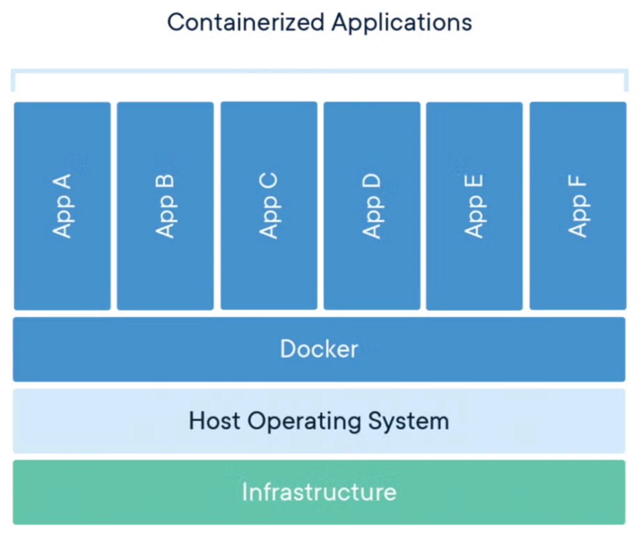
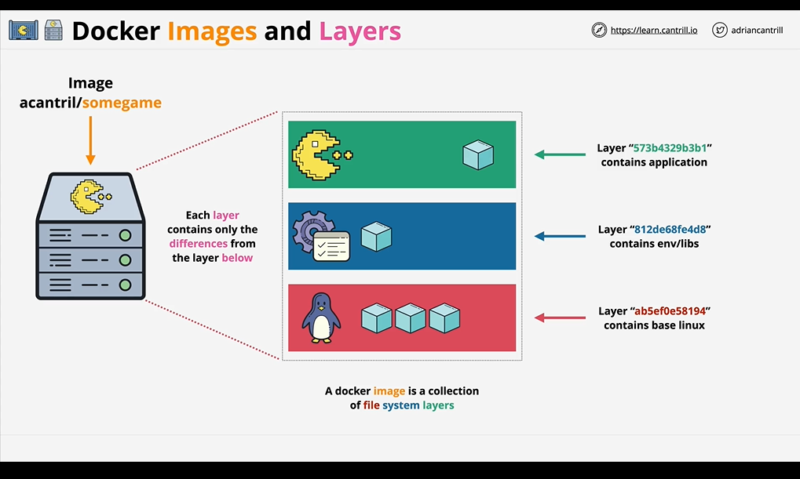
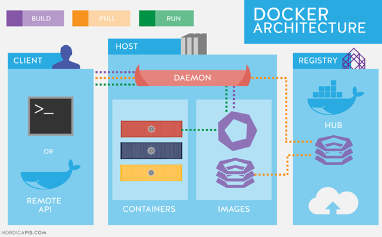

# Docker

## O que é o Docker?

O Docker é uma plataforma que permite o isolamento de aplicações por meio de containers, garantindo que processos sejam executados em ambientes independentes e consistentes.

Com o Docker, é possível empacotar uma aplicação junto com todas as suas dependências (bibliotecas, runtime e ferramentas do sistema) em uma chamada imagem, permitindo que ela seja executada de forma reprodutível em diferentes ambientes.

Diferentemente de máquinas virtuais, os containers compartilham o kernel do sistema operacional hospedeiro, tornando sua execução mais leve e eficiente. Dessa forma, o Docker facilita a portabilidade de aplicações e reduz problemas relacionados a diferenças de configuração entre ambientes.

### O que são containers?

Um container consiste em uma segregação de processos no mesmo sistema, de modo que a execução desse processo se encontra isolada do restante do sistema operacional. Containers empacotam uma aplicação e suas dependências em um ambiente controlado e reprodutível.

Um container possui camadas organizadas na seguinte arquitetura:

> **Camada personalizável:**
> - Aplicação: programa utilizado para executar determinada análise.
> - Bibliotecas: dependências necessárias para a execução correta do programa.

> **Docker Engine:** serviço que realiza a administração e o ciclo de vida dos containers.

> **Sistema operacional e componentes da máquina física.**



*Organização de um container no Docker. Fonte: [https://www.docker.com/resources/what-container/](https://www.docker.com/resources/what-container/).*

### O que são imagens?

Uma imagem Docker é um arquivo construído a partir de um `Dockerfile` — um arquivo de instruções que define como o ambiente deve ser montado. Podemos entender uma imagem como um documento imutável que carrega todas as informações necessárias para instanciar um container.

Na prática, as imagens são compostas por múltiplas **camadas somente leitura** (*read-only layers*), onde cada camada corresponde a uma instrução do `Dockerfile`. Essas camadas são reutilizadas sempre que possível, tornando o armazenamento e a transferência de imagens mais eficientes. De forma simplificada, as camadas essenciais de uma imagem são:

- Camada do sistema operacional
- Camada dos ambientes e dependências
- Camada da aplicação



*Fonte: [https://learn.cantrill.io/p/docker-fundamentals](https://learn.cantrill.io/p/docker-fundamentals)*

---

Vale destacar a distinção entre os dois conceitos centrais:

> **Imagem:** documento construído com os arquivos necessários para a execução de um programa. É imutável e serve como modelo.

> **Container:** uma instância em execução de uma imagem. Possui uma camada adicional de escrita, permitindo a criação de arquivos temporários durante a execução. Pode ser iniciado e parado a qualquer momento.

## Arquitetura do Docker

A arquitetura do Docker baseia-se em um modelo cliente-servidor, composto pelos seguintes elementos:

- **Docker Engine:** serviço que gerencia o ciclo de vida dos containers.
- **API REST do Docker Engine:** garante a comunicação entre o cliente (linha de comando) e o servidor (daemon do Docker).
- **Imagens:** obtidas de repositórios remotos, como o DockerHub, e armazenadas localmente.
- **Containers:** instâncias de imagens, criadas e configuradas a partir dos comandos do cliente.
- **Docker Registry:** aplicação para armazenar e distribuir imagens Docker



*Fonte: [https://nordicapis.com/api-driven-devops-spotlight-on-docker/](https://nordicapis.com/api-driven-devops-spotlight-on-docker/)*

## Demonstração 1: Comandos básicos do Docker

No ambiente do servidor, o Docker está instalado globalmente, de modo que conseguimos executar o programa sem precisar informar o caminho completo de instalação.

### Utilização do comando `--help`

```bash
docker --help
```

O argumento `--help` imprime na tela todas as funcionalidades básicas do Docker. Ele também pode ser utilizado após qualquer subcomando para exibir as opções disponíveis:

```bash
docker run --help
docker pull --help
```

### Comando `pull`: obtendo imagens

O comando `pull` permite baixar imagens disponibilizadas em repositórios remotos. Atualmente, o principal repositório é o [DockerHub](https://hub.docker.com/).

```bash
docker pull --help
docker pull hello-world:latest
```

> **Nota sobre tags:** a tag `:latest` sempre aponta para a versão mais recente disponível no repositório, o que pode mudar ao longo do tempo. Para análises reprodutíveis, prefira fixar uma versão específica, como `staphb/mafft:7.520`.

### Comando `images`: listando as imagens disponíveis

```bash
docker images --help
docker images --all
```

Em casos em que temos muitas imagens no sistema, podemos utilizar o argumento `--filter` para filtragem:

```bash
# Exemplos de condições aceitas pelo --filter:
#   dangling=(true|false)
#   label=<key> ou label=<key>=<value>
#   before=(<image-name>[:tag]|<image-id>)
#   since=(<image-name>[:tag]|<image-id>)
#   reference=(padrão de referência de imagem)
```

### Comando `image`: administrando imagens

O comando `image` permite administrar as imagens locais, incluindo remoção e inspeção.

```bash
docker image --help
docker image
docker tag hello-world:latest container_teste:funbios
```

### Comando `inspect`: inspecionando imagens e containers

Permite analisar as informações detalhadas de uma imagem ou container — incluindo configurações, variáveis de ambiente, volumes e metadados.

```bash
docker inspect --help
docker inspect container_teste:funbios
```

### Comando `run`: executando um container

Por meio do comando `run`, podemos executar um container a partir de uma imagem. Se a imagem não estiver disponível localmente, o Docker realiza o `pull` automaticamente.

```bash
docker run --help
docker run --rm container_teste:funbios #Esta opção [--rm] permite remover o container automaticamente ao fim da execução
```

### Comando `exec`: executando comandos em containers ativos

Permite executar comandos em um container que já está em execução.

```bash
docker exec --help
```

### Comando `ps`: listando containers em execução

```bash
docker ps --help
docker ps       # containers em execução
docker ps -a    # todos os containers, inclusive os parados
```

### Comando `logs`: visualizando a saída de um container

Útil para depurar containers que falham silenciosamente ou que executam em segundo plano.

```bash
docker logs --help
docker logs <container_id>
docker logs -f <container_id>   # acompanha em tempo real (follow)
```

### Comando `stop`: parando um container

```bash
docker stop --help
docker stop <container_id>
```

### Comando `cp`: copiando arquivos de e para containers

Permite transferir arquivos entre o sistema local e um container em execução — útil quando o mapeamento de volumes foi omitido.

```bash
docker cp --help
docker cp <container_id>:/caminho/no/container ./destino_local
docker cp ./arquivo_local <container_id>:/caminho/no/container
```

### Comando `rm` / `rmi`: removendo containers e imagens

O comando `rm` remove containers parados, enquanto `rmi` remove imagens. É importante destacar que a remoção de uma imagem só é possível se não houver containers associados a ela — mesmo que estejam parados. Nesses casos, remova os containers primeiro.

```bash
docker rm --help
docker rmi --help

docker rm <container_id>
docker rmi hello-world:latest
```

## Demonstração 2: Trabalhando com imagens

Neste exemplo, vamos utilizar a imagem do MAFFT, um programa de alinhamento de sequências disponibilizado pelo State Public Health Bioinformatics Community no DockerHub.

**1. Download da imagem.**

```bash
docker pull staphb/mafft:latest
```

**2. Executando comandos dentro do container.**

```bash
docker run --rm staphb/mafft mafft --help

# Note que a versão dentro do container pode diferir da instalada no servidor:
# mafft --version
# v7.503 (2022/Feb/3)
```

## Dockerfile: construindo suas próprias imagens

O `Dockerfile` é um arquivo de texto com as instruções necessárias para a montagem de uma imagem. Sua sintaxe é composta por palavras-chave seguidas de seus argumentos, uma por linha. As principais instruções utilizadas são:

| **Instrução** | **Descrição** |
| --- | --- |
| [`FROM`](https://docs.docker.com/reference/dockerfile#from) | Define a imagem base para o build. |
| [`RUN`](https://docs.docker.com/reference/dockerfile#run) | Executa comandos durante o build da imagem. |
| [`COPY`](https://docs.docker.com/reference/dockerfile#copy) | Copia arquivos e diretórios para dentro da imagem. |
| [`ADD`](https://docs.docker.com/reference/dockerfile#add) | Copia arquivos locais ou remotos para dentro da imagem. |
| [`CMD`](https://docs.docker.com/reference/dockerfile#cmd) | Define o comando padrão ao iniciar o container. |
| [`ENTRYPOINT`](https://docs.docker.com/reference/dockerfile#entrypoint) | Define o executável padrão do container. |
| [`ENV`](https://docs.docker.com/reference/dockerfile#env) | Define variáveis de ambiente. |
| [`EXPOSE`](https://docs.docker.com/reference/dockerfile#expose) | Documenta as portas que a aplicação escuta. |
| [`ARG`](https://docs.docker.com/reference/dockerfile#arg) | Define variáveis utilizadas apenas durante o build. |
| [`WORKDIR`](https://docs.docker.com/reference/dockerfile#workdir) | Define o diretório de trabalho dentro da imagem. |
| [`USER`](https://docs.docker.com/reference/dockerfile#user) | Define o usuário e grupo que executará os processos. |
| [`VOLUME`](https://docs.docker.com/reference/dockerfile#volume) | Declara pontos de montagem de volumes. |
| [`LABEL`](https://docs.docker.com/reference/dockerfile#label) | Adiciona metadados à imagem. |
| [`HEALTHCHECK`](https://docs.docker.com/reference/dockerfile#healthcheck) | Verifica a saúde do container na inicialização. |
| [`SHELL`](https://docs.docker.com/reference/dockerfile#shell) | Define o shell padrão da imagem. |
| [`ONBUILD`](https://docs.docker.com/reference/dockerfile#onbuild) | Define instruções a serem executadas quando a imagem for usada como base. |
| [`STOPSIGNAL`](https://docs.docker.com/reference/dockerfile#stopsignal) | Define o sinal de sistema usado para encerrar o container. |
| [`MAINTAINER`](https://docs.docker.com/reference/dockerfile#maintainer-deprecated) | *(Obsoleto)* Especifica o autor da imagem. |

> **Observação:** o arquivo de instruções deve ser nomeado exatamente como `Dockerfile` (sem extensão) para que o Docker o reconheça automaticamente.

## Demonstração 3: Construindo e executando um container

```bash
cd ~

mkdir minha_primeira_build

nano minha_primeira_build/Dockerfile
```

Cole o seguinte conteúdo no arquivo:

```dockerfile
FROM alpine:3.19

CMD ["echo", "Bem vindo ao 1º Curso de Bioinformática INCT-FUNBIOS"]
```

Uma vez com o `Dockerfile` criado, construa a imagem com:

```bash
docker build -t funbios_$USER:funbios minha_primeira_build/
```

Verifique se a imagem foi criada:

```bash
docker images
```

E execute o container:

```bash
docker run --rm funbios_$USER:funbios
```

## Armazenamento nos containers

Containers são efêmeros por natureza: tudo que é criado dentro deles durante a execução é descartado ao término do processo. Se quisermos manipular arquivos locais dentro de um container — ou salvar resultados produzidos por ele —, precisamos mapear um diretório do sistema hospedeiro para dentro do container. Esse mecanismo é chamado de **bind mount**.

O mapeamento é feito por meio dos argumentos `--mount` ou `-v` no comando `docker run`. Ambos realizam a mesma função, com diferença apenas de sintaxe:

```bash
# Com --mount (sintaxe key=value, mais explícita)
docker run --mount type=bind,src=/caminho/local,dst=/caminho/no/container

# Com -v (sintaxe compacta)
docker run -v /caminho/local:/caminho/no/container
```

- `src`: caminho do diretório no sistema hospedeiro.
- `dst`: caminho dentro do container onde o diretório será montado.

> **Nota:** o `type=bind` monta diretórios locais diretamente. O Docker também suporta `type=volume` (volumes gerenciados pelo Docker) e `type=tmpfs` (armazenamento em memória), mas o bind mount é o mais comum em fluxos bioinformáticos.

## Demonstração 4: Mapeamento de volumes

```bash
mkdir mount_exemplo
wget -O mount_exemplo/sequence.fasta "https://eutils.ncbi.nlm.nih.gov/entrez/eutils/efetch.fcgi?db=protein&id=NP_000257.1,NP_000483.3,NP_001009242.1&rettype=fasta&retmode=text"
```

```bash
docker run --rm -v $PWD/mount_exemplo:/data staphb/mafft mafft /data/sequence.fasta > alinhamento.fasta
```

## Modos interativos

Em determinados contextos, é útil abrir um terminal dentro do container para executar comandos manualmente — por exemplo, para explorar o ambiente ou depurar uma análise.

## Demonstração 5: Modo interativo

```bash
docker run --rm -u $(id -u):$(id -g) -it -v $PWD/mount_exemplo:/data staphb/mafft /bin/bash
```

Os argumentos utilizados são:

- `-u $(id -u):$(id -g)`: garante que o processo dentro do container rode com o mesmo usuário e grupo do sistema hospedeiro, evitando problemas de permissão em arquivos gerados.
- `-it`: combina `-i` (modo interativo) com `-t` (alocação de um terminal), abrindo um shell dentro do container.
- `-v $PWD/mount_exemplo:/data`: mapeia o diretório local para `/data` dentro do container.
- `/bin/bash`: define o shell a ser executado.

Para sair do ambiente bash do container, use o comando `exit`

---

Ao final, remova os containers e imagens criados:

```bash
docker ps -aq --filter ancestor=funbios_${USER}:funbios | xargs -r docker rm
docker rmi -f funbios_${USER}:funbios staphb/mafft:latest
```

## Referências

- [https://docs.docker.com/manuals/](https://docs.docker.com/manuals/)
- [https://learn.cantrill.io/p/docker-fundamentals](https://learn.cantrill.io/p/docker-fundamentals)

---