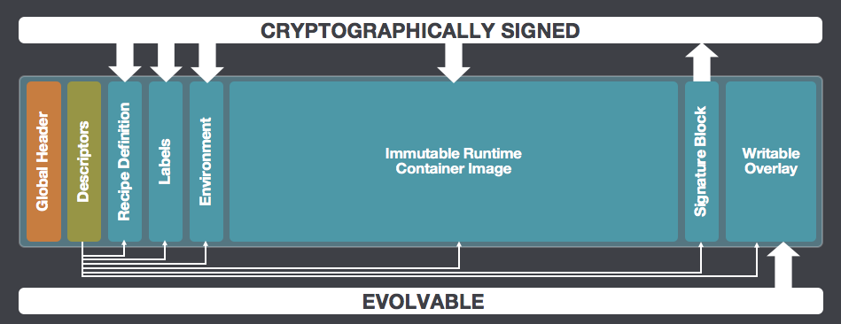

# Singularity/Apptainer

## O que é o Singularity?

O Singularity (atualmente chamado de **Apptainer**) é uma plataforma de containers projetada especificamente para ambientes de computação de alto desempenho (HPC) e servidores compartilhados.

> **Nota histórica:** o projeto Singularity foi transferido para a Linux Foundation em 2021 e renomeado para **Apptainer**. A versão mantida pela empresa Sylabs passou a se chamar **Singularity CE** (*Community Edition*). Em ambientes HPC modernos, o executável pode ser `apptainer` ou `singularity`, dependendo da instalação — ambos possuem sintaxe equivalente.

Assim como o Docker, o Singularity/Apptainer permite a criação e execução de programas em ambientes isolados e reprodutíveis. A principal diferença está no modelo de segurança: **o usuário dentro do container é o mesmo que o do sistema hospedeiro**, sem elevação de privilégios. Isso o torna muito mais adequado para servidores institucionais, onde o acesso de administrador é restrito.

## Containers e imagens

Os conceitos de container e imagem são equivalentes aos do Docker, com uma diferença arquitetural importante: no Singularity, as imagens são **arquivos únicos** com a extensão `.sif` (*Singularity Image Format*). Isso simplifica a distribuição e o armazenamento — uma imagem é apenas um arquivo portátil.



*Fonte: [apptainer/sif: Singularity Image Format (SIF) reference implementation](https://github.com/apptainer/sif)*

### Bind mounts automáticos

Ao contrário do Docker, o Singularity **monta automaticamente** alguns diretórios do sistema hospedeiro, como `$HOME`, `/tmp` e o diretório atual de trabalho. Isso significa que arquivos locais frequentemente já estão acessíveis dentro do container sem configuração adicional — mas também pode causar comportamentos inesperados se não for levado em conta.

## Demonstração 1: Comandos básicos do Singularity

### Utilização do `--help`

```bash
singularity --help
```

### Comando `pull`: obtendo imagens

O Singularity suporta múltiplos registros de imagens. O prefixo indica a origem:

```bash
singularity pull --help
singularity pull shub://vsoch/hello-world
```

### Comando `inspect`: inspecionando imagens

Permite visualizar os metadados e as definições de uma imagem `.sif`:

```bash
singularity inspect --help
singularity inspect hello-world_latest.sif
```

### Comando `run`: executando o comando padrão do container

Executa o comando definido como padrão na construção da imagem (equivalente ao `CMD`/`ENTRYPOINT` do Docker):

```bash
singularity run --help
singularity run hello-world_latest.sif
```

### Comando `exec`: executando comandos no container

Permite executar um comando diretamente em uma imagem:

```bash
singularity exec --help
singularity exec <imagem> <comando>
```

### Comando `shell`: abrindo um terminal interativo

Permite abrir um shell dentro do container para execução interativa de comandos:

```bash
singularity shell --help
```

### Argumento `--bind` / `-B`: mapeando diretórios

Assim como o `-v` do Docker, o `--bind` permite montar diretórios locais dentro do container. Este comando é útil em situações em que vamos utilizar arquivos localizados fora do nosso home

```bash
singularity exec --bind /caminho/local:/caminho/no/container minha_imagem.sif meu_programa
singularity exec -B $PWD:/data minha_imagem.sif meu_programa /data/arquivo.fasta
```

### Gerenciamento de cache

As imagens convertidas e baixadas ficam em cache no sistema. Em servidores com espaço limitado, é importante limpá-lo periodicamente:

```bash
singularity cache list     # visualiza o que está em cache
singularity cache clean    # limpa o cache
```

## Demonstração 2: Trabalhando com imagens

Neste exemplo, utilizaremos o FastTree para a inferência filogenética a partir do alinhamento gerado anteriormente.

```bash
# Baixando a imagem do DockerHub e convertendo para .sif
singularity pull docker://staphb/fasttree

# Executando a análise
singularity exec fasttree_latest.sif FastTree -nt alinhamento.fasta.trim > arvore.nwk
```

Após o uso, remova as imagens baixadas para liberar espaço:

```bash
rm *.sif
```

## Referências

- [https://apptainer.org/docs/](https://apptainer.org/docs/)
- [https://docs.sylabs.io/guides/3.6/user-guide.pdf](https://docs.sylabs.io/guides/3.6/user-guide.pdf)

---