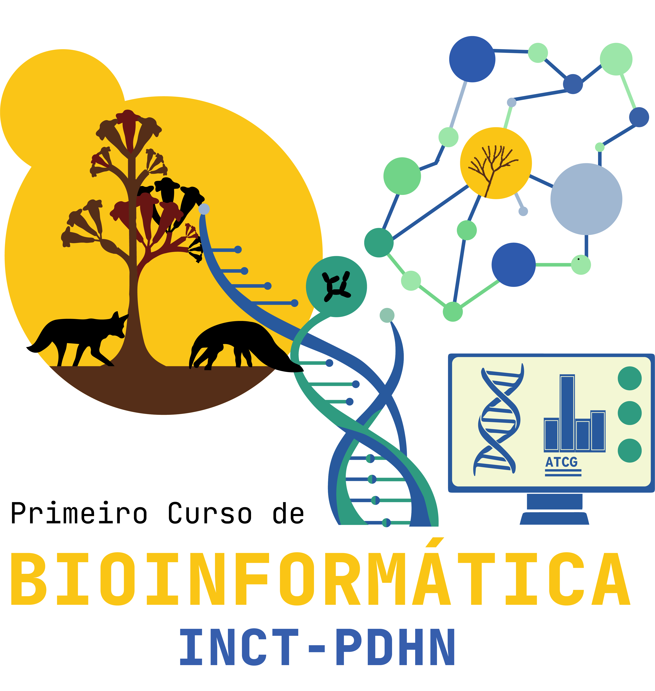

# Primeiro Curso de Bioinformática INCT-PDHN / FUNBIOS

> **Instituto Nacional de Ciência e Tecnologia de Patógenos de Doenças Humanas Negligenciadas (INCT-PDHN) / FUNBIOS**

# Primeiros passos para o acompanhamento do pré-curso

## Conta no GitHub

Crie uma conta na plataforma GitHub em [https://github.com/](https://github.com/), de acordo com os passos descritos no video abaixo:

## Conta no Google Colab

Crie uma conta na plataforma Google Colab em [https://colab.research.google.com/](https://colab.research.google.com/).

## Acompanhamento do pré-curso

O curso está disponível via GitHub em [https://github.com/lbm-ufg/pre-curso-inct-pdhn-funbios](https://github.com/INCT-PDHN-FUNBIOS/INCT-PDHN-FUNBIOS.github.io). Siga os passos descritos os módulos disponíveis na aba lateral para acompanhar o curso.

Usaremos toda a infraestrtura colaborativa do GitHub, incluindo as [issues](https://github.com/INCT-PDHN-FUNBIOS/INCT-PDHN-FUNBIOS.github.io/issues) para comunicação e resolução de dúvidas.
