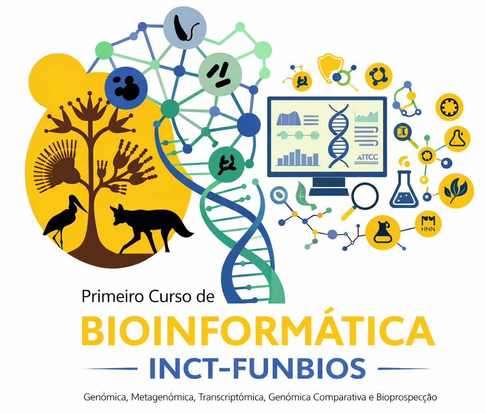

# Primeiro Curso de Bioinformática INCT-PDHN / FUNBIOS

> **Instituto Nacional de Ciência e Tecnologia de Patógenos de Doenças Humanas Negligenciadas (INCT-PDHN) / FUNBIOS**

---

## Sobre o Curso

O primeiro curso de Bioinformática do INCT-PDHN / FUNBIOS tem como objetivo capacitar os participantes na **análise e interpretação de dados "ômicos"**, com ênfase em genômica, transcriptômica, metagenômica e filogenômica de fungos.

---

## Datas e Formato

| Etapa | Período | Formato | Local |
|-------|---------|---------|-------|
| **Pré-evento** | 11 a 22/05/2026 | Atividades assíncronas e encontros virtuais | Online |
| **Evento principal** | 25 a 29/05/2026 | Presencial | Campus Samambaia – UFG, Goiânia/GO |

**Carga horária total:** 80 h (Pré-evento: 40 h + Curso: 40 h)

---

## Estrutura do Repositório

```
📁 pre-curso/         # Módulo preparatório (atividades assíncronas)
📁 curso/             # Módulo principal (evento presencial)
📁 dados/             # Dados utilizados nas práticas
📁 scripts/           # Scripts e pipelines do curso
📄 README.md          # Este arquivo
```

---

## Ementa

### Módulo Preparatório (Pré-evento – 40 h)

| Aula | Conteúdo | CH |
|-----|----------|-----|
| Intro | Introdução ao curso | -- |
| 1 | Boas práticas computacionais | 4 h |
| 2 | Introdução ao Git e ao GitHub | 6 h |
| 3 | Introdução à CLI – Bash | 8 h | 
| 4 | Python / BioPython | 8 h |
| 5 | R / Bioconductor | 8 h |
| 6 | Introdução aos ambientes computacionais: conda, docker, singularity e ambientes virtuais | 6 h |

---

## Pré-requisitos

- Noções básicas de biologia molecular
- Computador com acesso à internet
- Conta no Google (para uso do Google Colab)
- Conta no GitHub (recomendado)

---

## Organização

- **INCT-PDHN / FUNBIOS**
- Campus Samambaia, Universidade Federal de Goiás (UFG) – Goiânia, GO

---

## Contato

Para dúvidas e informações, entre em contato com a equipe organizadora pelo repositório (Issues) ou pelos canais oficiais do INCT-PDHN / FUNBIOS.

---

*Repositório mantido pelo Laboratório de Biologia Molecular (LBM-UFG)*
